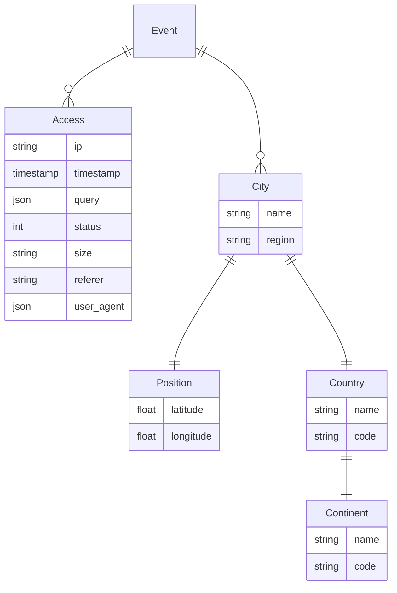

# NGINX Access Log Digest

This project is a two-part exercise in data analysis and visualization.
The first part is a Python script that reads an NGINX access log and
transforms it into a more structured format. The second part is a
Jupyter notebook that uses the produced data to analyze and visualize
the last two months of traffic on one of the platforms I work on:
[GitHub Search](https://seart-ghs.si.usi.ch).

## Mining Script

The mining script is a Python program that reads an NGINX access log
line-by-line and extracts the following fields:

- IP address
- Timestamp
- HTTP request
  - Method
  - Path
- HTTP response
  - Size in bytes
  - Status code
- User Agent
  - Browser
  - Device
  - OS
- Referrer

Apart from the fields above, the script also calculates the location of
each IP address using the [ipinfo.io](https://ipinfo.io/) API. All this
data is loaded into dataclasses and then exported to a CSV file. The data
model used can be represented with the following diagram:

## Jupyter Notebook

The Jupyter Notebook uses the data produced by the mining script to
perform the actual analysis and visualization. It's written in the
style of both a report and a tutorial. For each section, it explains the
individual steps taken to produce the analysis and visualization, while
also providing commentary on the results. Although we provide the data
to run the notebook yourself, we have also deployed it to a GitHub
Pages site, which you can access
[here](https://dabico.github.io/nginx-access-log-digest/notebook.html).

